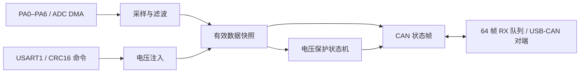

# STM32F103 低压 BMS 固件验证｜采集、保护与 CAN 故障恢复

在 STM32F103C8T6 上把 ADC DMA 采集、电压保护状态机、UART 命令和 CAN 上报连成一个可测试的固件流程。仓库包含主机测试、板端观察与故障定位记录，方便从结果追到源码。

**值得先看的三个结果**

- **真实总线与故障恢复**：500 kbit/s 双节点 CAN 收发；约 10 秒断开 CANH/CANL 后接回，MCU 无需复位即可恢复通信。[查看测试过程](docs/engineering-log.md#64帧队列限时断线复测)
- **连续运行记录**：在低压验证配置下运行 7532 秒（2 小时 5 分 32 秒），ADC 增加 753200 帧；该区间软件队列丢帧和硬件 FIFO 溢出计数均未增加。[查看负载和计数](docs/engineering-log.md#两小时连续运行)
- **可复核的保护逻辑**：虚拟电压注入触发过压、恢复并保留历史锁存；五组主机测试覆盖状态机、CRC16、CAN 编码/队列和注入联动。[查看测试](Tests/)

**验证配置**：STM32F103C8T6、0–3.3 V 模拟输入、USB-CAN 双节点；保护逻辑监控 PA0 单通道。

## 实现与证据

| 模块 | 实现 | 可检查的证据 |
| --- | --- | --- |
| 周期调度与采集 | TIM2 1 ms 时基；10 ms ADC1 七通道 DMA；四点滑动平均 | [源码](Core/Src/main.c)、[工程记录](docs/engineering-log.md)中的板端帧计数 |
| 电压保护 | PA0 单通道阈值；300 ms 故障确认、500 ms 恢复确认及回差 | [状态机](Core/Src/bms_protection.c)、[主机测试](Tests/test_bms_protection.c) |
| 通信 | USART1 收发 DMA、CRC16 命令；bxCAN 500 kbit/s 双节点收发，64 帧静态 RX 队列 | [串口协议](Core/Src/uart_protocol.c)、[CAN 接口](Core/Src/can_if.c)、[队列测试](Tests/test_can_rx_queue.c) |
| 故障注入 | 串口注入 0–3300 mV 虚拟电压，30 s 自动退出；注入值和 ADC 实测值分别保留 | [注入模块](Core/Src/bms_injection.c)、[联动测试](Tests/test_bms_injection.c) |

## 测试结果

- **主机测试**：覆盖保护确认与恢复、CRC 拒绝、CAN 报文编码、接收队列边界、注入与保护联动。运行方法见下文。
- **板端记录**：500 kbit/s 双节点 CAN 收发；约 10 秒 CANH/CANL 断开再接回后自动恢复；低压配置下连续运行 7532 秒，ADC 增加 753200 帧，`can_drop=0`、`can_hwov=0`。[查看基线与日志](docs/engineering-log.md#两小时连续运行)
- **注入验证**：3200 mV 注入触发过压，1500 mV 注入恢复，历史锁存保留；越界输入被拒绝，30 秒超时退出。300/500 ms 状态转移由主机单测覆盖。

## 构建与复现

1. 使用 STM32CubeMX 打开 [`led-test.ioc`](led-test.ioc)，或在 Windows 上安装 `arm-none-eabi-gcc` 和 `mingw32-make` 后运行 `mingw32-make -f Makefile -j2`。默认生成 `build/led-test.elf/.hex/.bin`。
2. 安装本机 GCC 后运行 `pwsh -File Tests/run_host_tests.ps1`，执行五组不依赖板卡的 C 测试。
3. 板端通信复现需要 STM32F103C8T6、ST-Link、3.3 V 逻辑兼容 CAN 收发器、USB-CAN、共地与正确终端电阻。串口 115200 8-N-1；CAN 500 kbit/s；输入采用限流 0–3.3 V 信号或虚拟注入。引脚与报文定义见[工程记录](docs/engineering-log.md#bxcan正常模式)。

## 代码导航

- [`Core/Src/main.c`](Core/Src/main.c)：任务调度、数据快照和协议集成。
- [`Core/Src/bms_protection.c`](Core/Src/bms_protection.c)：保护状态机；[`Core/Src/bms_injection.c`](Core/Src/bms_injection.c)：电压注入。
- [`Core/Src/can_if.c`](Core/Src/can_if.c)、[`can_rx_queue.c`](Core/Src/can_rx_queue.c)、[`can_protocol.c`](Core/Src/can_protocol.c)：CAN 驱动接口、静态队列与报文格式。
- [`Tests/`](Tests/)：可在主机上执行的纯 C 测试。
- [`docs/engineering-log.md`](docs/engineering-log.md)：按阶段记录异常、定位步骤与板端观察。

工程基于 STM32CubeMX 生成的 HAL/CMSIS 模板，第三方组件保留各自的版权与许可文件。
